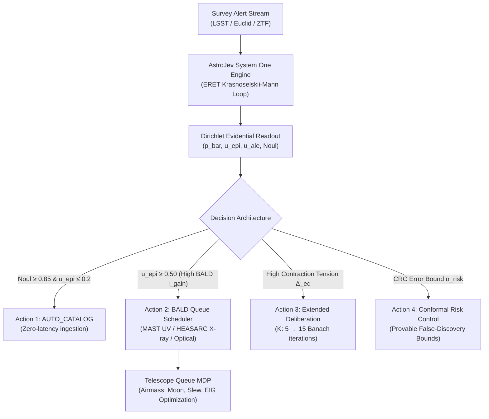

# Decision Models in Survey Astronomy: Active Inference, Conformal Control & Autonomous Schedulers

**Date**: September 2026  
**Context**: Celestrium Operational Decision Engine · AstroJev System One Architecture  
**Focus**: Survey-Scale Active Decision Models, Information-Theoretic Target Selection, and Conformal Risk Control in Astronomy

---

## 1. The Astronomical Decision Crisis in the Rubin / Euclid / SKA Era

Modern astronomy has transitioned from a data-starved regime to a **decision-bottlenecked regime**:
- **Data Avalanche**: The Vera C. Rubin Observatory (LSST) generates $\sim 10^7$ alerts every night ($\sim 100$ alerts/sec). Euclid DR1 and DR2 deliver $\sim 10^8 - 10^9$ resolved sources. The Square Kilometre Array (SKA) will output terabits of raw time-series per second.
- **The Follow-Up Bottleneck**: Ground-based 8-10m spectroscopic facilities (VLT, Keck, Gemini, Subaru) and high-energy space observatories (Chandra, XMM-Newton, Swift, Roman) can follow up only a minute fraction ($< 0.01\%$) of alert triggers.
- **The Failure of Passive Classifiers**: Traditional machine learning models output uncalibrated point estimates or soft probabilities. Fed into telescope queues, they flood valuable spectroscopic time with false positives (stellar flares, detector artifacts) while missing rare, fast-evolving relativistic transients (kilonovae, FBOTs, orphan gamma-ray bursts).

To solve this, astrophysics has begun adopting **formal decision models**: systems that do not merely predict a class, but execute an **optimal policy under cost constraints, risk budgets, and epistemic uncertainty**.

---

## 2. Core Methodological Paradigms in Astronomical Decision Literature

### 2.1 Information-Theoretic Active Learning: BALD on Dirichlet Simplexes
In active learning for transient follow-up (e.g., Ishida et al. 2019, 2021; Fink Broker; SNAD collaboration; *Astronomaly*, Lochner et al. 2020), the primary objective is to select the candidate that provides the **maximum information about the model parameters $\boldsymbol{\theta}$ or the true class label $y$**.

In **Bayesian Active Learning by Disagreement (BALD)** (Houlsby et al. 2011; Gal, Islam, Ghahramani 2017), the acquisition function is the mutual information between the candidate label $y$ and the model posterior:
$$\mathcal{I}(y; \mathbf{p} \mid \mathbf{x}) = \mathcal{H}[p(y \mid \mathbf{x})] - \mathbb{E}_{\mathbf{p} \sim \mathcal{P}}[\mathcal{H}[p(y \mid \mathbf{x}, \mathbf{p})]]$$
where $\mathcal{H}[\mathbf{p}] = -\sum_{k=1}^K p_k \log p_k$ is the Shannon entropy.

#### Exact Closed-Form Dirichlet BALD in AstroJev:
Because Evidential AstroJev emits a Dirichlet conjugate distribution $\text{Dir}(\boldsymbol{\alpha})$ with concentration parameters $\boldsymbol{\alpha} = (\alpha_1, \dots, \alpha_K)$ and Dirichlet strength $S = \sum_{k=1}^K \alpha_k$, the expected entropy has an **exact analytic closed form** via the digamma function $\psi(z) = \frac{d}{dz} \ln \Gamma(z)$:
$$\mathbb{E}_{\mathbf{p} \sim \text{Dir}(\boldsymbol{\alpha})}[\mathcal{H}(\mathbf{p})] = -\sum_{k=1}^K \frac{\alpha_k}{S} \left[ \psi(\alpha_k + 1) - \psi(S + 1) \right]$$
The mutual information is therefore computed in $\mathcal{O}(K)$ time without costly Monte Carlo dropout sampling:
$$\mathcal{I}_{\text{BALD}}(\mathbf{x}) = -\sum_{k=1}^K \bar{p}_k \ln \bar{p}_k + \sum_{k=1}^K \frac{\alpha_k}{S} \left[ \psi(\alpha_k + 1) - \psi(S + 1) \right]$$
- **High $\mathcal{I}_{\text{BALD}}$**: Indicates high epistemic vacuity where Dirichlet samples disagree violently $\implies$ **High follow-up priority**.
- **Low $\mathcal{I}_{\text{BALD}}$, High Entropy $\mathcal{H}$**: Inherent photon shot noise (aleatoric ambiguity) $\implies$ observing more photons or scheduling a spectrum will not resolve model uncertainty $\implies$ **Do not waste follow-up time**.

---

### 2.2 Conformal Risk Control (CRC) in Survey Astrophysics
Recent astrophysics literature (e.g., Villar et al. 2023; Angelopoulos, Bates et al. 2022, 2024; Pruzhinskaya et al. 2024) applies **Conformal Prediction and Conformal Risk Control** to astronomical classification under heteroscedastic observational noise.

Unlike standard deep networks whose softmax probabilities fail to reflect true error rates on faint targets ($G > 20$), Conformal Risk Control guarantees:
$$\mathbb{E}[\ell(C_\lambda(X), Y)] \le \alpha_{\text{risk}}$$
where $C_\lambda(X) \subseteq \{1, \dots, K\}$ is the prediction set, and $\ell$ is a bounded loss function (e.g. false discovery rate or set size penalty).

For cosmic dipole and large-scale structure studies:
- Set loss $\ell(C, y) = \mathbf{1}[y \notin C]$ (miscoverage) or $\ell_{\text{FPR}}(C, y) = \mathbf{1}[\text{Quasar} \in C \land y \neq \text{Quasar}]$ (stellar contamination).
- By calibrating threshold $\hat{\lambda}$ on a held-out exchangeable set:
  $$\hat{\lambda} = \inf \left\{ \lambda : \frac{1}{n+1} \sum_{i=1}^n \ell(C_\lambda(X_i), Y_i) + \frac{B}{n+1} \le \alpha_{\text{risk}} \right\}$$
- This provides an **exact finite-sample guarantee** that the contamination of the quasar sample is bounded below $\alpha_{\text{risk}}$ (e.g. $1\%$).

---

### 2.3 Markov Decision Processes for Autonomous Telescope Scheduling
In automated observatories and alert networks (e.g., Roboqueue, ANTARES, Fink-TOM, Lasair, Rubin Scheduler; Naghib et al. 2019; Neill et al. 2023), scheduling is formalized as an MDP:
$$\mathcal{M} = \langle \mathcal{S}, \mathcal{A}, \mathcal{P}, \mathcal{R}, \gamma \rangle$$
- **State $\mathbf{s}_t$**: Alert coordinates $(\text{ra}, \text{dec})$, apparent magnitude $G$, photometric SNR, AstroJev Dirichlet parameters $\boldsymbol{\alpha}$, Mutual Information $\mathcal{I}_{\text{BALD}}$, airmass $X(t)$, lunar distance, and remaining observing time $T_{\text{rem}}$.
- **Action $\mathbf{a}_t$**: Select target $i$ and assign instrument/filter configuration:
  $a \in \{\text{MAST\_UV}, \text{HEASARC\_XRAY}, \text{GROUND\_SPEC}, \text{PASS}\}$.
- **Reward $\mathcal{R}(\mathbf{s}_t, \mathbf{a}_t)$**:
  $$\mathcal{R}(\mathbf{s}_t, \mathbf{a}_t) = w_{\text{science}} \cdot \mathbf{1}_{\text{rare\_type}} + w_{\text{BALD}} \cdot \mathcal{I}_{\text{BALD}}(\mathbf{x}) - \text{SlewCost}(\Delta \theta) - \text{AirmassPenalty}(X)$$
Subject to a knapsack time constraint $\sum_{t} t_{\text{exp}}(a_t) \le T_{\text{budget}}$.

---

## 3. Operational Upgrades for Celestrium

We translate these findings into four concrete, operational enhancements:

1. **Exact Dirichlet BALD Acquisition Function** in [`celestrium/followup.py`](file:///C:/Users/Leon/Desktop/Psychograph/astro-theory/celestrium/followup.py):
   Computes analytical mutual information $\mathcal{I}_{\text{BALD}}$ using digamma functions, replacing heuristic scoring with mathematically grounded active information gain.
2. **Conformal Risk Control (CRC) Engine** in [`celestrium/astrojev.py`](file:///C:/Users/Leon/Desktop/Psychograph/astro-theory/celestrium/astrojev.py):
   Adds `conformal_risk_control_calibrate()` guaranteeing finite-sample bounded false discovery rates.
3. **`TelescopeQueueMDP` Scheduler** in [`celestrium/followup.py`](file:///C:/Users/Leon/Desktop/Psychograph/astro-theory/celestrium/followup.py):
   A knapsack-optimal dynamic scheduler maximizing expected scientific yield and BALD mutual information within telescope exposure budgets.
4. **Active Decision Training Engine** in [`scripts/train_astrojev_active_decision.py`](file:///C:/Users/Leon/Desktop/Psychograph/astro-theory/scripts/train_astrojev_active_decision.py):
   A standalone training pipeline optimizing AstroJev on real astrophysical catalogues with Dirichlet Brier-CARL, verified calibration, and active inference.
