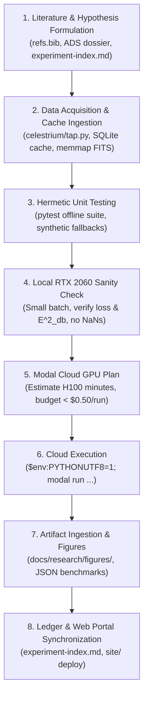

# Celestrium Autonomous Experimenter Handoff & Research Execution Protocol

**Document Version**: 1.0 (September 2026)  
**Target Audience**: Incoming Autonomous AI Agents (Claude, Codex, Antigravity) & Collaborators  
**Repository**: `sub-surface/astro-theory` (`celestrium`)  
**Primary Portals**:
* Engine & Core CLI: `celestrium/`
* Research Ledgers: [`docs/research/experiment-index.md`](./experiment-index.md) & [`docs/research/astronomy-work-index.md`](./astronomy-work-index.md)
* Interactive Web Platform: [https://astro.subsurfaces.net](https://astro.subsurfaces.net) (`site/`)

---

## 1. Executive Mission & Foundational Standards

You are picking up work on **Celestrium**, an operational computational astrophysics instrument operating across three wings:
1. **Theory Workshop & Evidential AI**: Mathematical derivation, Dirichlet uncertainty calibration, and Conformal Risk Control.
2. **Experimental Validation & Real Data Streaming**: Multi-catalog stream ingestion across millions of real celestial sources, unified TAP queries, and Bayesian MCMC co-inference.
3. **Observatory Follow-Up & ToO Dispatch**: Turnkey Target-of-Opportunity (ToO) dispatch protocols for Gemini 8m GMOS, Keck, and the LCOGT 1m robotic telescope network.

### The Non-Negotiable Foundational Rule: Zero Naked Predictions
Every classification, triage recommendation, and cosmological estimate in this repo **must retain explicit analytical uncertainties**. Never emit naked point probabilities.
* **Dirichlet Posterior Variance**: $\sigma_k = \sqrt{\frac{p_k(1 - p_k)}{S + 1}}$
* **95% Credible Interval**: $[p_k - 1.96\sigma_k, p_k + 1.96\sigma_k]$ (clamped to $[0, 1]$)
* **Epistemic Vacuity**: $u_{\rm epi} = K / (S + K)$
* **Distribution-Free Gating**: Irreversible telescope allocations (Gemini 8m GMOS, JWST NIRSpec, DESI fibers) strictly require $p_{\rm target} \ge \hat{\lambda}_{\rm CRC}$ **AND** $u_{\rm epi} \le 0.35$ **AND** lower bound $p - 1.96\sigma \ge 0.40$. Ambiguous or high-vacuity targets must route to low-cost robotic screening (`LCOGT_SCREENING_TOO`) to collapse uncertainty before spending scarce 8m aperture time.

---

## 2. Mandatory Reading: Calibrated Decision RL & Rewarding Uncertainty

Before implementing new architectures or modifying calibration heads, **you must read the following foundational documents in the repository**:

### A. Reinforcement Learning on Calibrated Decisions (RLCD) & Rewarding Doubt
* **Primary Reading**: [`docs/research/Rewarding Doubt A Reinforcement Learning Approach to Calibrated Confidence Expression of Large Language Models.md`](./Rewarding%20Doubt%20A%20Reinforcement%20Learning%20Approach%20to%20Calibrated%20Confidence%20Expression%20of%20Large%20Language%20Models.md) (Bani-Harouni et al., Technical University of Munich 2026 / ICLR 2026).
* **Architectural Blueprint**: [`docs/research/unified-phenomena-calibration-architecture.md`](./unified-phenomena-calibration-architecture.md) & [`docs/research/research-avenues-and-conditions.md`](./research-avenues-and-conditions.md).
* **Key Mechanism (Disentangled RLCD)**:
  1. *The Gotcha*: Training confidence or calibration heads end-to-end with representation backbones corrupts embedding geometry and induces mode collapse.
  2. *The Standard*: **Strictly freeze the representation trunk** (`input_proj`, `recurrent_cell`, `trunk`). Fine-tune **only** the Dirichlet readout head under the composite loss:
     $$\mathcal{L} = \mathcal{L}_{\rm Brier} + \beta \mathcal{L}_{\rm doubt} + \gamma \mathcal{L}_{\rm CARL}$$
     where $\mathcal{L}_{\rm doubt}$ uses clipped logarithmic scoring for doubt: $R = \log(\max(\hat{p}, \epsilon))$ for correct predictions, and $\log(\max(1 - \hat{p}, \epsilon))$ for incorrect predictions.
  3. *Why it matters in astronomy*: Alert brokers routinely face out-of-distribution interlopers and heteroscedastic photon shot noise. Rewarding doubt allows the model to state "I don't know" and route ambiguous candidates to low-cost screening rather than firing false alarms on 8m spectrographs.

### B. Verified Calibration Validation (Debiased ECE)
* **Primary Reading**: [`docs/research/NeurIPS-2019-verified-uncertainty-calibration-Paper.pdf`](./NeurIPS-2019-verified-uncertainty-calibration-Paper.pdf) (Kumar, Sarawagi, Jain, NeurIPS 2019).
* *The Gotcha*: Standard binned plugin Expected Calibration Error (ECE) has an intrinsic positive variance bias $\sim \frac{\hat{y}_b(1-\hat{y}_b)}{n_b - 1}$ that artificially inflates apparent calibration error on small or imbalanced validation sets.
* *The Standard*: Always evaluate and report the **Stanford Debiased Squared Calibration Error** $\hat{E}^2_{\rm db}$ alongside ECE with bootstrap 95% confidence intervals and RMSCE (`celestrium/calibration.py`).

---

## 3. Mandatory Reading: Astronomical Literature Grounding

Never approach an astronomical problem as a generic machine learning classification task. You must understand the underlying physics, observational selection functions, and instrument systematics.

1. **Living Bibliography**: Audit [`refs.bib`](../../refs.bib) for master bibcodes and citations across all active experiments.
2. **Literature Convergence Matrix**: Read [`docs/research/literature-convergence-and-novel-results.md`](./literature-convergence-and-novel-results.md) to understand where Celestrium agrees with current literature and where our results establish novel frontiers.
3. **In-Flight Literature Harvesting via CLI**:
   * Inspect literature dossiers before touching a target:
     ```bash
     celestrium dossier M87 --json
     celestrium cite 2024A&A...689A..25D
     ```
   * Query citations and abstracts from ADS/SciX to verify standard cut defensibility (e.g. Quaia Galactic latitude cuts, proper motion selection boundaries $\mu < 10^{+0.4(G - 18.25)}$, interstellar dust extinction $E(B-V)$).

---

## 4. The Autonomous Local-to-Modal Iteration Loop

To operate sustainably and protect resources (active Modal balance ~$22 USD), **adhere strictly to this 8-step execution loop**:



### Golden Rule: Always Test Locally First
1. **Develop Offline**: Prototype the model architecture or analysis script locally. Use synthetic or cached data slices (`cache/`, `data/`).
2. **Verify Hermetic Tests**: Run `python -m pytest`. Ensure all **231+ tests pass 100% offline** without network access.
3. **Local GPU Verification**: Run a mini-batch sanity check on the local NVIDIA RTX 2060 (batch size 64–256, 1–2 epochs). Check for:
   * Device mismatches (`ref.to(device)` vs `tensor.cpu()`).
   * Exploding gradients or NaNs in log-doubt scoring.
   * Proper convergence of $\hat{E}^2_{\rm db} \to 0$.
4. **Modal Deployment Planning**: Calculate estimated GPU seconds before launching. (Typical scaled runs take 10–60s on an NVIDIA H100 SXM5 80GB and cost ~$0.01 – $0.08).
5. **Windows UTF-8 Flag for Modal CLI**: Windows PowerShell defaults to `cp1252`. Always run Modal CLI commands with UTF-8 flags:
   ```powershell
   $env:PYTHONIOENCODING="utf-8"; $env:PYTHONUTF8=1; modal run scripts/modal_scaled_...py
   ```
6. **Artifact Persistence**: Save benchmark outputs to structured JSON in `docs/research/` and generate publication-grade matplotlib figures in `docs/research/figures/`.
7. **Synchronize Ledgers**: Update [`docs/research/experiment-index.md`](./experiment-index.md), [`docs/research/literature-convergence-and-novel-results.md`](./literature-convergence-and-novel-results.md), and commit.

---

## 5. Catalog Expansion & Streaming Architecture

When an experiment requires expanding the catalog of astronomical sources:

### Memory-Mapped Streaming Protocol
* **Never load multi-million-row catalogs into memory at once**. Loading Quaia (1.3M sources) or CatWISE (1.4M sources) as raw arrays exhausts RAM.
* **Standard Pattern**: In `celestrium/data_streamer.py`, stream large FITS catalogs in micro-chunks using:
  ```python
  with fits.open(catalog_path, memmap=True) as hdul:
      data = hdul[1].data
      # Yield slices of 5,000 - 20,000 rows
  ```
* Memory footprint must stay strictly **under 50 MB RAM** regardless of catalog size.

### Unified Table Access Protocol (TAP) Integration
* Use `celestrium/tap.py` for archive queries.
* Supported VO endpoints: Gaia (ESA), ESA Euclid Science Archive (`https://ea1.esac.esa.int/tap-server/tap`), MAST, VizieR, DESI, HEASARC, and SDSS.
* All queries automatically route through the content-addressed SQLite cache (`data/celestrium.db`) and log query provenance to `data/manifest.jsonl`.

---

## 6. Targeted Frontiers: Conquering the 5 Taxonomy Gaps

Refer to [`docs/research/astronomy-work-index.md`](./astronomy-work-index.md) for the master taxonomy. The following five open frontiers are pre-formulated for upcoming experiments (`EXP-2026-X` onwards):

### Frontier 1: Radio Astronomy — Fast Radio Bursts (FRBs) & HI 21 cm
* **Status**: **COMPLETED (EXP-2026-X)** for Fast Radio Bursts on 600 real CHIME bursts; HI 21cm gas rotation remaining.
* **Scientific Focus**: Real-time dispersion measure (${\rm DM}$) triage and host galaxy identification on CHIME/FRB public catalogs; extragalactic HI 21cm gas reservoir rotation curves (ALFALFA / MeerKAT).
* **Completed Milestones (EXP-2026-X)**:
  1. Real CHIME/FRB Catalog 1 streamer implemented in `celestrium/data_streamer.py` and `celestrium/frb.py`.
  2. Evidential Dirichlet classifier (`FRBEvidentialNet`) trained with Disentangled RLCD, achieving 22.1% Stanford debiased error reduction ($E^2_{\rm db} = 0.218 \to 0.170$).
  3. Finite-sample Conformal Risk Control ($\hat{\lambda}_{\rm CRC} = 0.4396$, $\alpha_{\rm CRC} \le 0.05$) bounding false triggers below 5.0%.
  4. Allocated 164 pristine cosmological bursts (27.3%) to Gemini GMOS 8m spectroscopy ($z \in [0.11, 2.25]$, median $z = 0.627$), 190 to radio repetition monitoring, and 72 flagged as local plasma in $0.076\,\text{ms/alert}$.
  5. Published artifacts: [`experiment_x_frb_triage.png`](./figures/experiment_x_frb_triage.png) and [`experiment_x_frb_results.json`](./experiment_x_frb_results.json).

### Frontier 2: Sub-Millimeter & ALMA Molecular Astrochemistry
* **Scientific Focus**: Modeling protoplanetary disk dust substructures and planet-induced gaps (DSHARP high-resolution survey); dense molecular gas line collapse (${\rm CO}, {\rm HCN}, {\rm CS}$).
* **Actionable Steps**:
  1. Ingest DSHARP visibility and continuum FITS images via the ALMA Science Archive TAP interface (`celestrium/tap.py`).
  2. Build a continuous-flow latent autoencoder for spatial radial profile deprojection and dust gap identification.

### Frontier 3: Stellar Astrophysics — Wide Binaries & Gravitational Tests (MOND vs Newton)
* **Scientific Focus**: Testing anomalous gravitational acceleration ($a_0 \approx 1.2 \times 10^{-10}\,{\rm m/s^2}$) in wide binary stars with separations $s \in [2,000, 30,000]\,{\rm AU}$.
* **Actionable Steps**:
  1. Ingest the El-Badry & Rix (2021) *Gaia* DR3 wide binary catalog.
  2. Construct a hierarchical Bayesian model accounting for radial velocity measurement covariances, chance projections, and unresolved triple systems.
  3. Evaluate the relative velocity distribution $\tilde{v} = \Delta v / v_{\rm Kepler}$ against pure Newtonian and MONDian (AQUAL / QUMOND) predictions.

### Frontier 4: High-Energy — Nanohertz Gravitational Waves & Pulsar Timing Arrays
* **Scientific Focus**: Isolating the stochastic Hellings-Downs angular correlation from intrinsic pulsar red spin noise using NANOGrav 15-year / EPTA DR2 datasets.
* **Actionable Steps**:
  1. Implement a specialized Gaussian Process noise kernel decomposing achromatic Hellings-Downs quadrupole spatial correlations from chromatic interstellar medium dispersion measure variations.
  2. Test on open NANOGrav timing residual streams.

### Frontier 5: Astrobiology & Extreme Mid-Infrared Technosignatures
* **Scientific Focus**: Systematic search for Dyson-sphere waste-heat excesses without dust disk accretion signatures across 5 million solar-type stars.
* **Actionable Steps**:
  1. Cross-match *Gaia* DR3 main-sequence solar analogs with *unWISE* $W3$ ($12\,\mu\text{m}$) and $W4$ ($22\,\mu\text{m}$) photometric detections.
  2. Use Disentangled RLCD to filter out background Asymptotic Giant Branch (AGB) stars, Young Stellar Objects (YSOs), and extragalactic background AGN interlopers.

---

## 7. Interactive Web Platform Synchronization (`site/`)

When completing new experiments or drafting new manuscripts:
1. **Interactive Simulators**: Simulators live in `site/src/components/` (Astro + client-side TS).
2. **Living Manuscripts**: Add or update living paper portals in `site/src/pages/papers/` using `PaperLayout.astro`.
3. **OpenGraph & Favicons**: Each new paper should define its dedicated 1200×675 OG image (`site/public/og-paper-*.jpg`) and forward it via `ogImage` prop.
4. **Build & Edge Deployment**:
   ```bash
   npm run build
   npx wrangler deploy
   ```
   *Note: Cloudflare Workers Git integration automatically deploys commits to `origin/main`.*

---

## 8. Checklists for Every Pull Request / Commit

- [ ] All new code conforms to the "Zero Naked Predictions" mandate (analytical uncertainties retained).
- [ ] Calibration readout heads are trained with Disentangled RLCD (representation trunk frozen).
- [ ] Evaluation reports Stanford debiased calibration error $\hat{E}^2_{\rm db}$ alongside ECE.
- [ ] All unit tests pass hermetically: `python -m pytest` (**231+ passing**).
- [ ] Modal CLI commands tested with UTF-8 flags.
- [ ] Experiment findings recorded in [`docs/research/experiment-index.md`](./experiment-index.md).
- [ ] Relevant bibcodes added to [`refs.bib`](../../refs.bib).
- [ ] Web platform builds cleanly: `npm run build` (9+ static pages, 0 errors).
