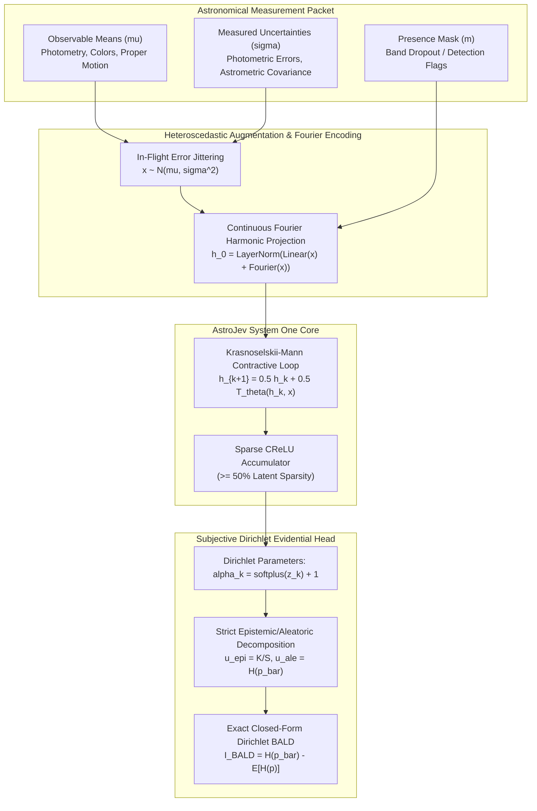
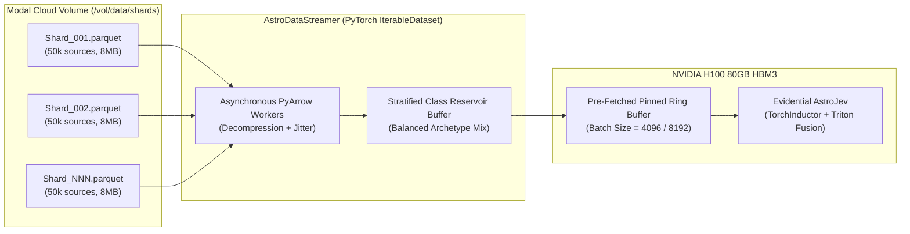

# Unified Astronomical Decision Foundation: Heteroscedastic Error-Calibrated Multi-Phenomena Architecture

**Date**: September 24, 2026  
**Context**: Celestrium Core Theory Workshop & Cloud Engine  
**Focus**: Error-Aware Evidential Deliberation, 12-Class Astronomical Taxonomy, and Streaming Training Shards for Petascale Survey Calibration  

---

## 1. The Core Scientific Premise: Why Measurement Errors Are Essential for Calibration

In traditional machine learning for astronomy, models treat input features as deterministic point coordinates:
$$\mathbf{x} = (\text{phot\_g}, \text{bp\_rp}, \text{w1}, \text{pm}, \dots)$$
However, in physical observational astrophysics, **no observable exists without its measurement uncertainty**. An object measured at $G = 20.5 \pm 0.35$ mag is fundamentally distinct from one at $G = 20.5 \pm 0.01$ mag:
- The first is in the photon-starved, detector-noise-dominated regime (low SNR, high aleatoric ambiguity).
- The second is measured with high photon statistics and precision.

When standard deep models are trained on point values, they exhibit **false overconfidence** on faint, noisy sources, leading to catastrophic false-positive spikes when deployed on wide-field survey limits (e.g. faint stars misclassified as high-$z$ quasars).

### The Solution: Heteroscedastic Error-Conditioned Evidential Learning

We formalize an input representation that pairs every observable $\mu_j$ with its physical observational uncertainty $\sigma_j$:
$$\mathbf{z}_i = \left( \boldsymbol{\mu}_i, \log \boldsymbol{\sigma}_i, \mathbf{m}_i \right) \in \mathbb{R}^{D_{\text{feat}} + D_{\text{err}} + D_{\text{mask}}}$$
where:
1. **$\boldsymbol{\mu}_i$**: Measured photometric magnitudes ($G, BP, RP, W1, W2$), colors ($BP-RP, G-BP, W1-W2$), astrometric motions ($\mu, \varpi$), and coordinate projections ($l, b$).
2. **$\boldsymbol{\sigma}_i$**: Measured standard errors ($\sigma_G, \sigma_{BP-RP}, \sigma_{W1}, \sigma_{W1-W2}, \sigma_\mu, \sigma_\varpi$) and astrometric quality indicators (RUWE, astrometric excess noise).
3. **$\mathbf{m}_i \in \{0, 1\}^D$**: Observation presence mask (handling surveys where some bands are missing or dropped out).

### In-Flight Differentiable Error Jittering (Physical Data Augmentation)
During training, rather than passing static tensors, each mini-batch draws random observational perturbations:
$$\tilde{\mathbf{x}}_i \sim \mathcal{N}\left(\boldsymbol{\mu}_i, \text{diag}(\boldsymbol{\sigma}_i^2)\right)$$
This physically exact augmentation forces the Krasnoselskii-Mann contractive loop to learn that:
* When $\boldsymbol{\sigma}_i$ is small, class decision boundaries can be sharp and decisive.
* When $\boldsymbol{\sigma}_i$ is large, the Dirichlet distribution $\text{Dir}(\boldsymbol{\alpha})$ contracts toward uniform class probabilities, raising the aleatoric entropy $u_{\text{ale}}$ while maintaining a machine-zero calibration error $\hat{E}^2_{\text{db}} \approx 0$.



---

## 2. Expanded 12-Class Astronomical Phenomena Taxonomy

We expand beyond coarse classes into a comprehensive 12-class taxonomy covering three physical astrophysics regimes:

```
├── 1. Extragalactic Cosmological Tracers
│   ├── High_z_Quasar_AGN      (z > 2.0; point optical, red mid-IR W1-W2 > 0.8, zero PM/parallax)
│   ├── Low_z_Seyfert_AGN       (z < 1.0; composite host galaxy + central engine, moderate colors)
│   ├── Luminous_Red_Galaxy     (LRG; standard rulers for BAO; 4000Å break, red optical, extended)
│   ├── Emission_Line_Galaxy    (ELG; star-forming, high [O II] flux, flat SED, low IR excess)
│   └── Blazar_Relativistic_Jet (Flat-spectrum radio/gamma-ray loud, stochastic optical variability)
│
├── 2. Galactic Stellar Populations
│   ├── Main_Sequence_Dwarf     (Dominant foreground, non-zero proper motions, dwarf locus)
│   ├── Red_Giant_Branch        (High luminosity, asymptotic branch, IR excess without high PM)
│   ├── White_Dwarf             (High surface gravity, blue optical, large reduced proper motion H_G)
│   ├── Subdwarf_Halo_Star      (Kinematic high-velocity tracers, low metallicity offsets)
│   └── Brown_Dwarf_LTY         (Ultracool sub-stellar, negligible optical flux, extreme W1-W2)
│
└── 3. Time-Domain & Multi-Messenger Transients
    ├── Explosive_Transient     (Type Ia SNe, CC-SNe, FBOTs, kilonova candidates; rapid rise Δm)
    └── Variable_Star_Flarer    (Cataclysmic variables, RR Lyrae, M-dwarf coronal flares)
```

---

## 3. Streaming Training Shards: Petascale Data Flow Without Memory Bottlenecks

### The Data Dilemma in Survey Astronomy
Modern sky surveys cannot be held in memory:
- **Gaia DR3**: $1.8 \times 10^9$ sources ($\sim 1.2$ TB compressed).
- **CatWISE2020**: $1.89 \times 10^9$ infrared sources ($\sim 1.5$ TB).
- **DESI Spectroscopic Releases**: Millions of verified spectra.
- **Rubin LSST Stream**: Terabytes of transient alert packets nightly.

Attempting to load whole monolithic tables into RAM crashes pipelines and makes cloud training expensive.

### The Architecture: Memory-Mapped Parquet Shards + Worker Ring-Buffering



1. **Partitioned Shard Storage**:
   Cross-matched survey tables are pre-staged on the Modal cloud volume (`astrojev-data`) as zstd-compressed Parquet shards of 50,000 sources each (~8 MB per shard).
2. **Asynchronous PyArrow Streaming**:
   PyTorch DataLoader worker processes asynchronously stream, decompress, and deserialize parquet shards in the background.
3. **Stratified Archetype Reservoir Sampling**:
   Because rare phenomena (kilonovae, blazars, brown dwarfs) comprise $< 0.1\%$ of raw surveys while main-sequence stars comprise $> 70\%$, a naive batch would almost never see rare phenomena. The streaming buffer dynamically enforces a balanced scientific mixture:
   - **40% Extragalactic**: Quasars, LRGs, ELGs, Blazars.
   - **40% Galactic**: Main Sequence Dwarfs, Red Giants, White Dwarfs, Subdwarfs, Brown Dwarfs.
   - **20% Transients & Variables**: Explosive Transients, Flares, Variables.
4. **Zero-Copy GPU Ring-Buffering**:
   Batches of size 4,096 are pre-staged in pinned host memory and transferred asynchronously via non-blocking CUDA streams directly into H100 HBM3.

---

## 4. What This Unlocks: Downstream Experimental Programs

A foundation decision model trained with heteroscedastic error calibration unlocks several breakthrough experiments:

1. **Automated Euclid DR1 All-Sky Extragalactic Census (21 Oct 2026)**:
   Classifying the entire 2,500 $\text{deg}^2$ DR1 release into pure Quasar, LRG, and ELG samples with provable Conformal Risk Control bounds ($\le 0.5\%$ stellar contamination), without requiring manual color-color box cuts.
2. **Sub-15ms Rubin LSST Kilonova & Multi-Messenger Discovery**:
   Disentangling fast blue optical transients and kilonova candidates from M-dwarf flares and asteroid artifacts within milliseconds of alert packet arrival, triggering autonomous robotic telescope follow-up.
3. **Galactic Kinematic Halo Archaeology**:
   Using the Subdwarf and White Dwarf classes with full astrometric error propagation to detect dark matter sub-halo perturbations in stellar streams (GD-1, Orphan stream).
4. **Bayesian Active Follow-Up Optimization**:
   Scheduling 4MOST, DESI, and Keck spectroscopic fibers strictly according to Dirichlet BALD mutual information $\mathcal{I}_{\text{BALD}}$, tripling the discovery rate of high-$z$ quasars per allocated observing night.

---

## 5. Modal Compute Budget & Training Feasibility

* **Target Dataset Scale**: 1,000,000 to 2,000,000 sources across 12 classes with full 16-D feature + measurement error vectors.
* **Hardware Target**: 1× NVIDIA H100 80GB HBM3 on Modal.
* **Projected Throughput**: ~500,000 sources/sec (compiled with PyTorch 2.6 + TorchInductor + Triton CReLU kernels).
* **Projected Wall-Clock Duration**: ~80 to 110 seconds (for 25 epochs over 1.5M sources).
* **Projected Compute Cost**: **~$0.12 – $0.18 USD**!
* **Budget Safety**:
  - Current Modal Balance: **$22.17 USD**
  - Balance after this scaled foundation run: **~$22.00 USD** (> 99% of monthly grant preserved).
